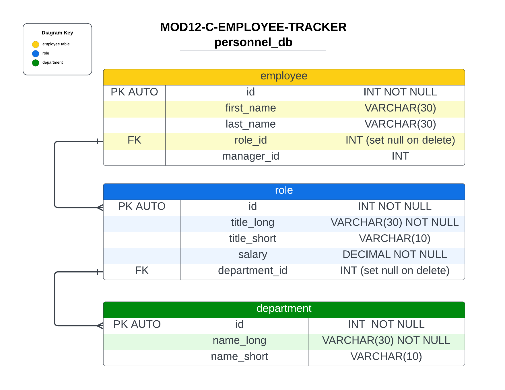

# MOD12-C-Employee-Tracker
--- Employee-Tracker 

[](https://opensource.org/licenses/MIT)

## Description
A command-line application that allows a user to  enter, view and manage employees, departments and roles in a business. 
A Content Management System (CMS) using Node.js, Inquirer, and MySQL.

## Table of Contents
  
- [User Story](#userstory)
- [Acceptance Criteria](#acceptance-criteria)
- [Bonus](#bonus)
- [Visual Documentation](#visual-documentation)
- [Installation](#installation)
- [Usage](#usage)
- [Credits](#credits)
- [License](#license)
- [Feature](#features)
- [How to Contribute](#contribute)
- [How to Test](#test)
- [Contact Info](#contact)


## User Story

```md
AS A business owner
I WANT to be able to view and manage the departments, roles, and employees in my company
SO THAT I can organize and plan my business
```

## Acceptance Criteria

```md
GIVEN a command-line application that accepts user input
WHEN I start the application
THEN I am presented with the following options: view all departments, view all roles, view all employees, add a department, add a role, add an employee, and update an employee role
WHEN I choose to view all departments
THEN I am presented with a formatted table showing department names and department ids
WHEN I choose to view all roles
THEN I am presented with the job title, role id, the department that role belongs to, and the salary for that role
WHEN I choose to view all employees
THEN I am presented with a formatted table showing employee data, including employee ids, first names, last names, job titles, departments, salaries, and managers that the employees report to
WHEN I choose to add a department
THEN I am prompted to enter the name of the department and that department is added to the database
WHEN I choose to add a role
THEN I am prompted to enter the name, salary, and department for the role and that role is added to the database
WHEN I choose to add an employee
THEN I am prompted to enter the employee’s first name, last name, role, and manager, and that employee is added to the database
WHEN I choose to update an employee role
THEN I am prompted to select an employee to update and their new role and this information is updated in the database 
```
## Bonus

Some additional functionality:

```md
* View employees by manager.

* View employees by department.

* Delete departments, roles, and employees.

* View the total utilized personnel budget by department.
```

## Visual Documentation

The following video shows the application being used from the command line:

[](https://clipchamp.com/watch/9hVxhFfRJO9)


## Visual Database Schema

The following is a visual representation of the personnel_db database schema.



## Installation

Initialize npm to produce the package.json file. Then install: 
-- MySQL2 package
-- inquirer@8.2.4
-- console.table
 
In the command line, type npm start.


## Usage
JavaScript, JavaScript with Node.js, inqurirer

## Credits

I would like to thank Erik Hoversten for tutoring me though the async/await, constructor functions, Trey Eckels for teaching about modules and everything else, my family for putting up with this crazy.

## License

This application is using the The MIT License License. Click on the badge  [](https://opensource.org/licenses/MIT)  to follow the link to the license.

---

## Features

Modular routes, MySQL2, inquirer@8.2.4, console.table

## How to Contribute

This application follows the [Contributor Covenant](https://www.contributor-covenant.org/).

If you would like to contribute it, you can create an issue on GitHub repository at https://github.com/LRicciardo/MOD11-C-Note-Taker. 

## Tests


  
## Contact Info

This application follows the [Contributor Covenant](https://www.contributor-covenant.org/).

If you would like to contact me about an issue, you can send an email to Liane.Ricciardo@gmail.com.
